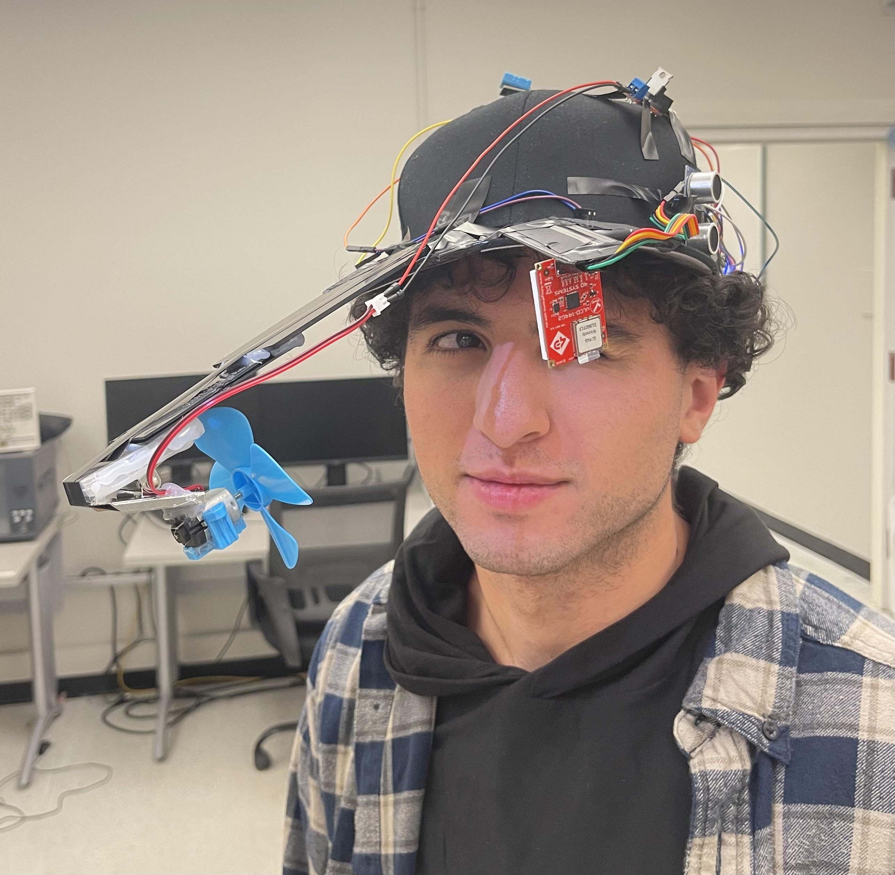
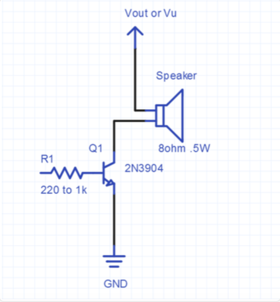
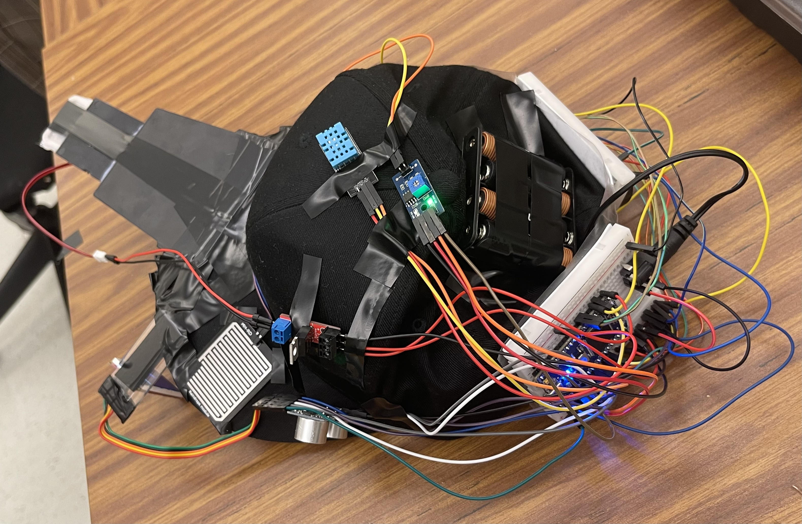
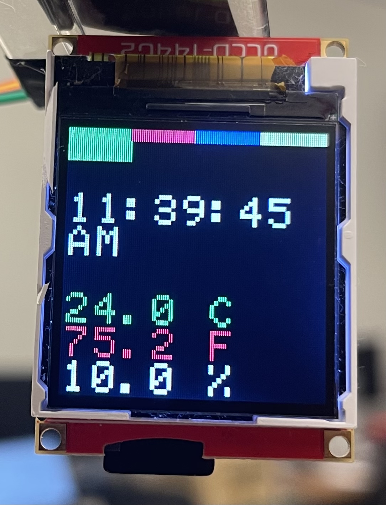
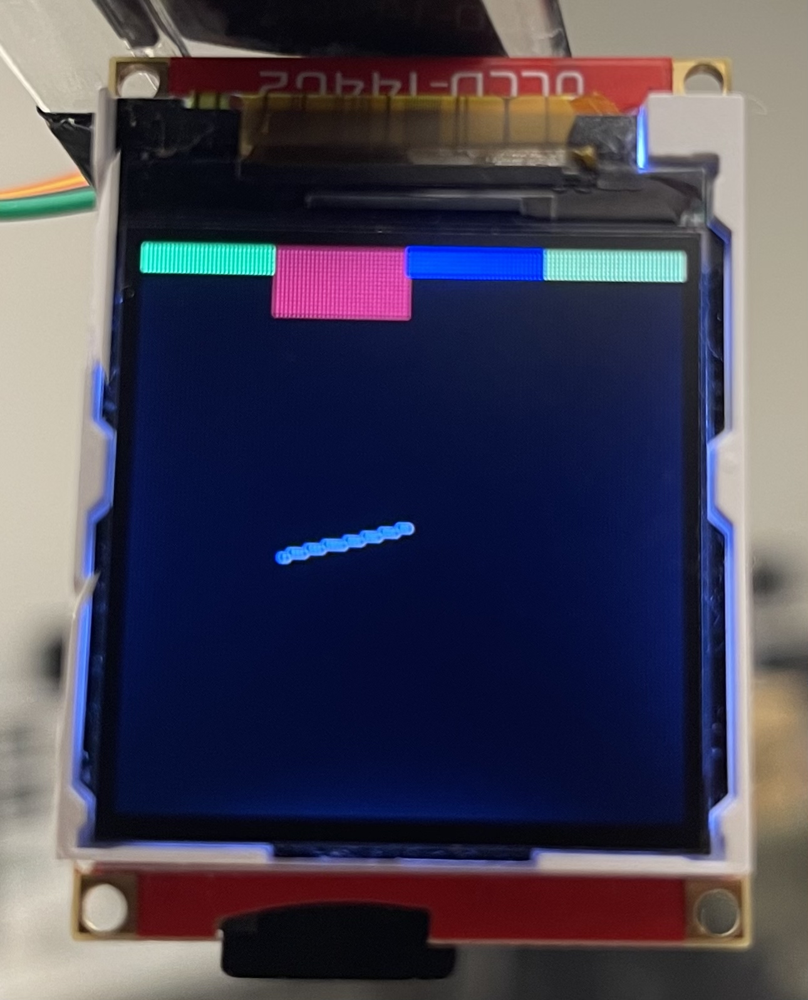
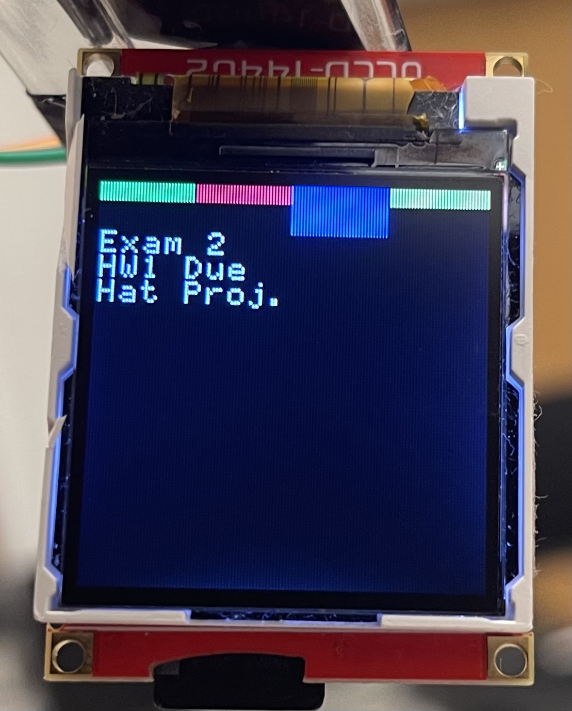
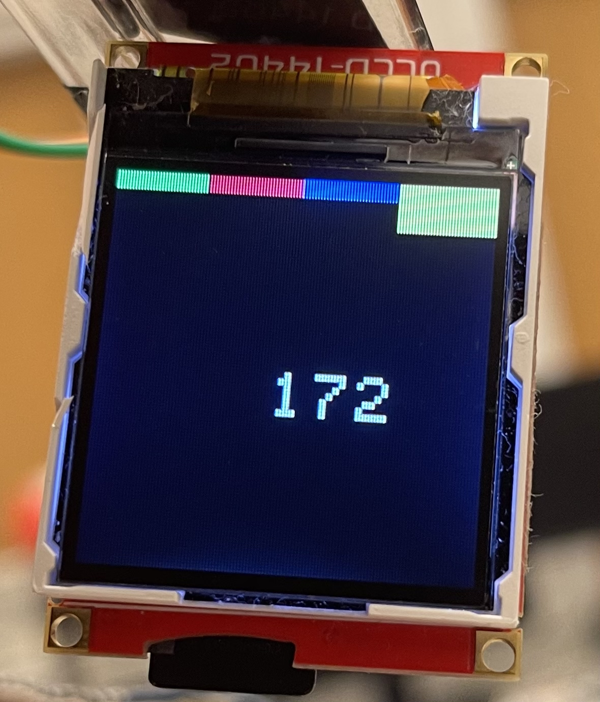

# The Smart Hat (ECE-4180 Final Project)
Team Members: Pengyu Mo, Xueqing Li, Phat Bui, Joseph Ferraro

## Table of Content
* [Project Description](#project-description)
* [Technical Specification](#technical-specification)
* [Part Lists](#parts-list)
* [Wiring](#wiring)
* [Pictures](#pictures)

## Project Description
We want to develop a smart hat designed to integrate a range of Internet of Things (IoT) functionalities. This hat features an ultra-thin LCD (uLCD) screen on the brim for displaying information. To ensure the wearer is prepared for various weather conditions, we have included a temperature sensor and a rain detection sensor. Additionally, a speaker is incorporated to emit sounds, particularly useful when the rain sensor activates, indicating conditions where wearing the device might be unsuitable. For navigation and orientation assistance, an inertial measurement unit (IMU) tracks the wearer's movement and direction. On the side of the hat, there is a fan that activates to provide cooling when needed. All these functionalities are Bluetooth-enabled, allowing for convenient control and management through a phone or other device. Our design aims to create a hat that easily integrates into daily life while offering high functionality and convenience.


*<p align="center">The Smart Hat Prototype</p>*

## Technical Specification
The Smart Hat is controlled by the Mbed LPC1768 microcontroller. Connected to the Mbed are several components: multiple sensors, an uLCD display, a Bluetooth module, a speaker, and a motor. We have selected these parts for their common usage in many Internet of Things (IoT) devices, ensuring accessibility and compatibility. The code necessary to operate the Mbed in this project is available on the wiki page as ```Final_Project.tar```.


*<p align="center">The Smart Hat Block Diagram</p>*

## Parts List

Here are the selected parts for our design:
- Mbed LPC1769
- uLCD-144-G2 128
- HC-SR04 Ultrasonic Sensor
- uxcell A13082300ux1431 Water Sensor
- Adafruit Bluefruit LE UART
- DHT11 Temperature & Humidity Sensor
- SparkFun IMU Breakout
- SparkFun Breadboard Mount Speaker
- DC Micro 130 Gear Motor With Fan Blade
- SparkFun MOSFET Power Control
- SparkFun Battery Holder - 4xAA to Barrel Jack Connector

## Wiring

### Bluetooth

| Bluetooth | MOD | CTS | TXO | RXI | VIN        | RTS | GND | DFU |
|-----     |-----|-----|-----|-----|-----       |-----|-----|-----|
|  Mbed    |     | GND | P14 | P13 | 5V external|     | GND |     |

### Rain drop detector (MH sensor)

| MH Sensor| AO  | DO  | GND | Vcc |
|-----     |-----|-----|-----|-----|
|  Mbed    | P20 | P5  | GND | VIN |

### uLCD

|uLCD| 5V         | RX  | TX | GND | RES |
|----|-----       |-----|----|-----|-----|
|Mbed| 5V external| P10 | P9 | GND | P11 |

### DHT11

|DHT11| +   | OUT | -  |
|---- |-----|-----|----|
|Mbed | VIN | P23 |GND |

### Sonar

|Sonar| Vcc       | Trig | Echo| GND|
|---- |-----      |----- |---- |----|
|Mbed |5V external| P6   |  P7 | GND|

### IMU

|IMU  | SCL | SDA | UDO| GND|
|---- |-----|-----|----|----|
|Mbed | P27 | P28 | VIN| GND|

### Motor

|Motor|C  | +  | -  |
|---  |---|--- |--- |
|Mbed |P21| P27| GND|


### Speaker



|R1 |Vout or Vu |
|---|---        |
|P24|5V external|

## Pictures

*<p align="center">The Smart Hat With All Parts Assembled</p>*


*<p align="center">uLCD Page 1 Display</p>*


*<p align="center">uLCD Page 2 Display</p>*


*<p align="center">uLCD Page 3 Display</p>*


*<p align="center">uLCD Page 4 Display</p>*


